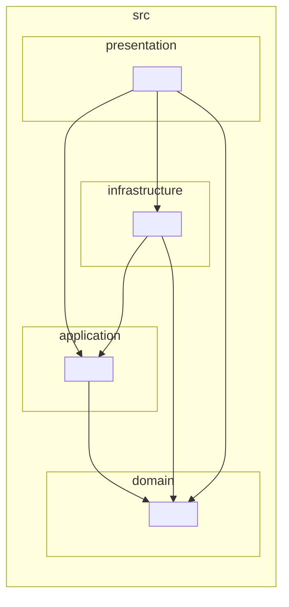

# Architecture

Clean-Architecture layering per
[`.agents/skills/nextjs-clean-arch-drizzle/SKILL.md`](../.agents/skills/nextjs-clean-arch-drizzle/SKILL.md).
Dependencies flow **one way only**: `domain → application → infrastructure → presentation`
(an arrow `A --> B` means "A depends on B", so inner layers have no outgoing arrows to outer ones).

This diagram is generated from the real import graph — regenerate with
`npm run depcruise:graph` (collapsed to the layer level). The rules behind it are
enforced on every `npm run lint:all` and in CI via
[`.dependency-cruiser.cjs`](../.dependency-cruiser.cjs).

## What is enforced mechanically vs by review

**Automated (dependency-cruiser — structural / import-graph):**
- `domain` stays pure (no Next.js / ORM / React / outer-layer imports)
- `application` depends on interfaces only (no `infrastructure`, ORM, or `presentation` imports)
- `presentation/components` never import the DI container or a repository directly
- every Drizzle repository + secret-touching service imports `server-only`
- no dependency cycles

**Still covered by tests + review (semantic — an import graph can't see these):**
- every query is scoped by `shopId` / tenant id
- `requireRole()` guards each protected action
- business logic actually lives in the right use case (not just imported correctly)

These semantic rules are exercised by the integration tests (real use cases + Drizzle
repos against an in-memory libSQL DB); see [the test setup](../scripts/test.mjs).
